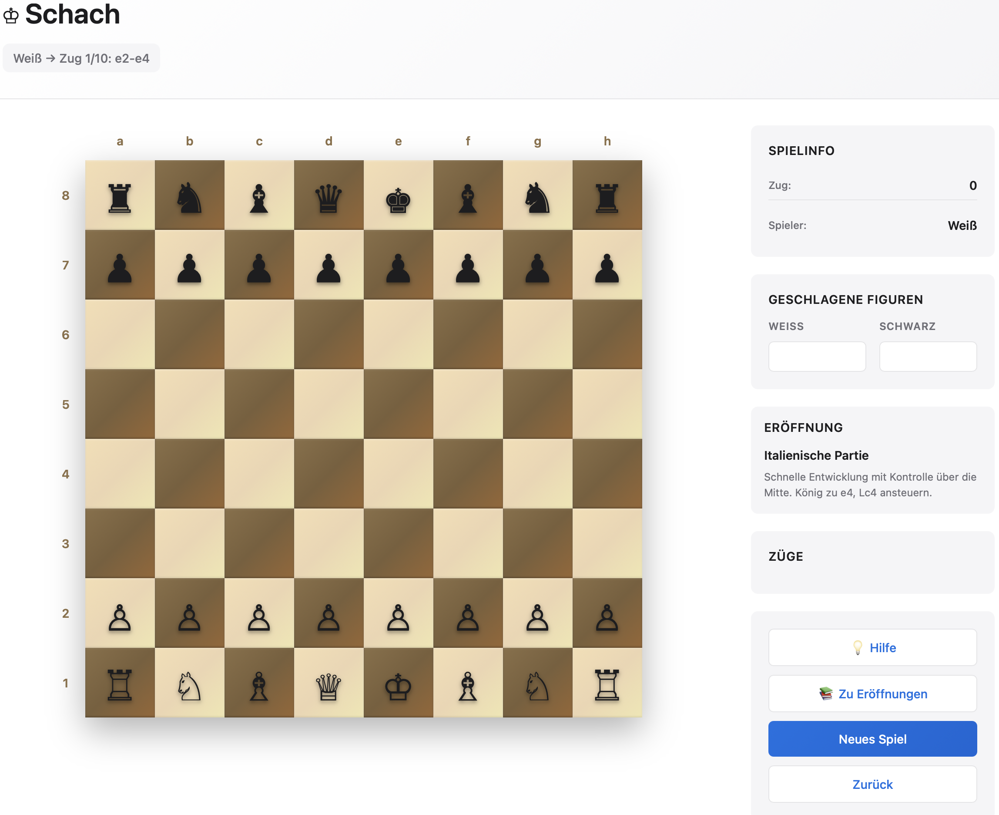

# Schach

Eine vollständige Schachapplikation im Browser – gebaut mit reinem HTML, CSS und JavaScript, ohne externe Abhängigkeiten.



## Features

### Spielmodi

| Modus | Beschreibung |
|---|---|
| **Spieler vs. Spieler** | Zwei Personen spielen abwechselnd am selben Gerät |
| **Gegen Computer** | KI-Gegner mit 6 Schwierigkeitsstufen |
| **Eröffnungen lernen** | Geführtes Training für 10 klassische Eröffnungen |

### Computergegner – Schwierigkeitsstufen

| Stufe | ELO-Bereich | Bezeichnung |
|---|---|---|
| 1 | 800–1000 | Anfänger |
| 2 | 1000–1200 | Hobby |
| 3 | 1200–1400 | Intermediär |
| 4 | 1400–1600 | Fortgeschritten |
| 5 | 1600–1800 | Meister |
| 6 | 1800+ | Großmeister |

Die KI verwendet den **Minimax-Algorithmus mit Alpha-Beta-Pruning** (Suchtiefe bis 6 Halbzüge).

### Eröffnungen

10 klassische Eröffnungen, je 10 Züge geführt:

- Italienische Partie
- Spanische Partie (Ruy Lopez)
- Skandinavische Verteidigung
- Französische Verteidigung
- Sizilianische Verteidigung
- Königsgambit
- Damengambit
- Schottische Partie
- Philidor-Verteidigung
- Englische Eröffnung

Nach Abschluss einer Eröffnung erscheint ein Abschluss-Modal mit Zuganzahl, Spielzeit und einer Empfehlung für die nächste Eröffnung.

### Schachregeln

- Alle Standard-Zugregeln (Bauer, Springer, Läufer, Turm, Dame, König)
- Rochade (kurz und lang) – wird korrekt gesperrt nach König- oder Turmzug
- Schachprüfung – illegale Züge, die den eigenen König in Schach lassen, werden verhindert
- Schachmatt-Erkennung über fehlende legale Züge

### Benutzeroberfläche

- Koordinaten-Beschriftung (a–h, 1–8) am Brett
- Hervorhebung gültiger Züge (Punkt für freies Feld, Rahmen für Schlagfeld)
- Letzter Zug wird farblich markiert
- Geschlagene Figuren werden separat angezeigt
- Zughistorie in algebraischer Notation
- **Soundeffekte** via Web Audio API (unterschiedlicher Ton für normalen Zug vs. Schlagen)
- **Schlag-Animation** auf dem Zielfeld
- **Hinweis-Funktion** im Eröffnungsmodus: hebt Start- und Zielfeld für 5 Sekunden hervor
- Zug rückgängig machen (im PvC-Modus werden zwei Halbzüge zurückgenommen)

## Verwendung

Da es sich um eine reine Frontend-Applikation handelt, genügt es, die Datei direkt im Browser zu öffnen:

```bash
open index.html
```

Oder über einen lokalen Webserver (z. B. für den Live-Reload bei der Entwicklung):

```bash
npx serve .
# oder
python3 -m http.server 8080
```

Kein Build-Schritt, keine Abhängigkeiten, kein Node.js erforderlich.

## Dateistruktur

```
chess/
├── index.html    # HTML-Struktur, Menüs, Spielbereich, Modal
├── styles.css    # Styling (Brett, Figuren, Sidebar, Animationen)
└── script.js     # Spiellogik (Chess), KI (Computer), UI (ChessUI)
```

### Architektur (`script.js`)

| Klasse | Verantwortung |
|---|---|
| `Chess` | Spielzustand, Regelprüfung, Zugvalidierung, Rochade, Undo |
| `Computer` | Minimax-Algorithmus, Alpha-Beta-Pruning, Schwierigkeitssteuerung |
| `ChessUI` | DOM-Rendering, Event-Handling, Soundeffekte, Animationen, Modi |

Die Eröffnungsdaten sind als Konstante `OPENINGS` am Anfang der Datei definiert.
